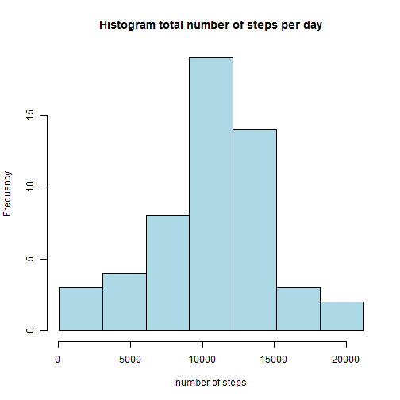
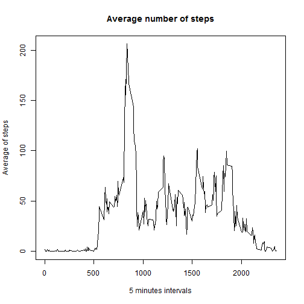
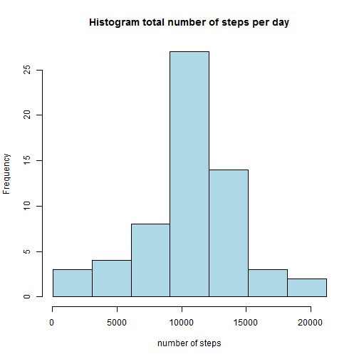
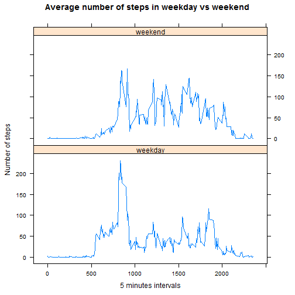

#Peer Assessment 1


###Loading and preprocessing the data
The variables included in this dataset are:  
steps: Number of steps taking in a 5-minute interval (missing values are coded as NA)  
date: The date on which the measurement was taken in YYYY-MM-DD format  
interval: Identifier for the 5-minute interval in which measurement was taken

```r
if (!file.exists("activity.csv")) {
        download.file("http://d396qusza40orc.cloudfront.net/repdata%2Fdata%2Factivity.zip", destfile = "activity.zip")
        unzip("activity.zip")
}
data<-read.csv("activity.csv",sep=",")
```

###What is mean total number of steps taken per day?
1.First we calculate the total number of steps taken per day

```r
tspd<-tapply(data$steps,data$date,sum)
#we ignore the missing values
tspd<-tspd[complete.cases(tspd)]
tspd
```

```
## 2012-10-02 2012-10-03 2012-10-04 2012-10-05 2012-10-06 2012-10-07 
##        126      11352      12116      13294      15420      11015 
## 2012-10-09 2012-10-10 2012-10-11 2012-10-12 2012-10-13 2012-10-14 
##      12811       9900      10304      17382      12426      15098 
## 2012-10-15 2012-10-16 2012-10-17 2012-10-18 2012-10-19 2012-10-20 
##      10139      15084      13452      10056      11829      10395 
## 2012-10-21 2012-10-22 2012-10-23 2012-10-24 2012-10-25 2012-10-26 
##       8821      13460       8918       8355       2492       6778 
## 2012-10-27 2012-10-28 2012-10-29 2012-10-30 2012-10-31 2012-11-02 
##      10119      11458       5018       9819      15414      10600 
## 2012-11-03 2012-11-05 2012-11-06 2012-11-07 2012-11-08 2012-11-11 
##      10571      10439       8334      12883       3219      12608 
## 2012-11-12 2012-11-13 2012-11-15 2012-11-16 2012-11-17 2012-11-18 
##      10765       7336         41       5441      14339      15110 
## 2012-11-19 2012-11-20 2012-11-21 2012-11-22 2012-11-23 2012-11-24 
##       8841       4472      12787      20427      21194      14478 
## 2012-11-25 2012-11-26 2012-11-27 2012-11-28 2012-11-29 
##      11834      11162      13646      10183       7047
```
2.We make a histogram of the total number of steps taken each day

```r
n.clases<-7
points<-min(tspd)+(0:n.clases)*(max(tspd)-min(tspd))/n.clases
hist(tspd,breaks=points,col="lightblue",main="Histogram total number of steps per day",xlab="number of steps")
```

 

3.We calculate the mean and median of the total number of steps taken per day

```r
mean(tspd)
```

```
## [1] 10766.19
```

```r
median(tspd)
```

```
## [1] 10765
```
###What is the average daily activity pattern?
1. We make a time series plot of the 5-minute interval (x-axis) and the average number of steps taken, averaged across all days (y-axis)

```r
data1<-data[complete.cases(data),]
asbi<-tapply(data1$steps,as.factor(data1$interval),mean)
plot(unique(data1$interval),asbi,type="l",main="Average number of steps",xlab="5 minutes intervals",ylab="Average of steps")
```

 

2. Which 5-minute interval, on average across all the days in the dataset, contains the maximum number of steps?

```r
interval<-row.names(asbi)
df<-data.frame(interval,asbi)
int<-df[df$asbi==max(asbi),]$interval
```

The maximum number of steps are in the interval **835**  

###Imputing missing values

1. Calculate and report the total number of missing values in the dataset

```r
sum(!complete.cases(data))
```

```
## [1] 2304
```
2. We fill the missing values using the mean for that interval
3. We create a new dataset filling the missing values:

```r
n.ind<-dim(data)[1]
newdata<-data
for(i in 1:n.ind){
    if(is.na(newdata[i,]$steps)){
        newdata[i,]$steps<-df[df$interval==data[i,]$interval,]$asbi
    }else{
        newdata[i,]$steps<-data[i,]$steps
    }
}
```

4. Make a histogram of the total number of steps taken each day.

```r
tspd2<-tapply(newdata$steps,newdata$date,sum)
n.clases<-7
points<-min(tspd2)+(0:n.clases)*(max(tspd2)-min(tspd2))/n.clases
hist(tspd2,breaks=points,col="lightblue",main="Histogram total number of steps per day",xlab="number of steps")
```

 

Calculate and report the mean and median total number of steps taken per day:

```r
mean(tspd2)
```

```
## [1] 10766.19
```

```r
median(tspd2)
```

```
## [1] 10766.19
```

The only value that differ from from the estimates from the first part of the assignment is the median but little.

###Are there differences in activity patterns between weekdays and weekends?

1. We create a new factor variable in the dataset with two levels - "weekday" and "weekend" indicating whether a given date is a weekday or weekend day.

```r
newdata$date<-as.Date(newdata$date)
weekdays<-weekdays(newdata$date)
weekdays<-ifelse(weekdays=="sábado"|weekdays=="domingo","weekend","weekday")
newdata<-data.frame(newdata,weekdays)
```
2. We make a panel plot containing a time series plot of the 5-minute interval (x-axis) and the average number of steps taken, averaged across all weekday days or weekend days (y-axis).

```r
library(lattice)
splitdata<-aggregate(steps~interval+weekdays,newdata,FUN="mean")
xyplot(steps~interval|weekdays,data=splitdata,type="l",main="Average number of steps in weekday vs weekend",ylab="Number of steps",xlab="5 minutes intervals",layout=c(1,2))
```

 


